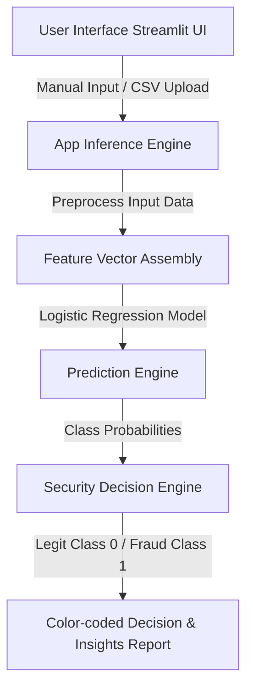

# 💳 Advanced Credit Card Fraud Detection Platform

Welcome to the **Advanced Credit Card Fraud Detection Platform**! This repository hosts a publication-grade, responsive, and high-fidelity Streamlit web application designed to identify fraudulent credit card transactions in real time with high accuracy using an optimized machine learning engine.

---

## 🚀 Key Features

- **💫 High-Fidelity Futuristic UI**: Sleek dark-mode aesthetic built using custom CSS injections, high-end typography, glassmorphism, responsive grids, and micro-animations.
- **⚡ Dual Prediction Modes**:
  - **Single Transaction Manual Check**: Enter specific transaction parameters grouped intuitively into logical sections.
  - **Batch Transaction Processor**: Drag-and-drop a CSV dataset to perform real-time high-throughput predictions. Features interactive paginated data tables, dynamic progress indicators, and an instant CSV report download.
- **✨ Instant Preset Loader**: Skip manual data entry! Load pre-configured sample transactions (validated Legitimate vs. known Fraudulent) with a single click to instantly demo predictions.
- **📊 Interactive Analytics & KPI Metrics**: Beautiful visualization cards, color-coded risk alerts, and structured security reports outlining prediction confidence.

---

## 🛠️ Tech Stack & Architecture



- **Core Framework**: Streamlit (v1.56.0)
- **Modeling Engine**: Scikit-Learn (v1.7.2) Logistic Regression Classifier
- **Data Engineering**: Pandas (v2.3.3) & NumPy (v1.26.4)
- **Dataset Context**: Kaggle Credit Card Fraud Detection Dataset (containing highly PCA-transformed features V1–V28, transaction Time, and transaction Amount). The raw dataset is available for download here: [Google Drive Dataset Link](https://drive.google.com/file/d/1saezV0OU9sSKmGVxXzRpRvwILlEtbrIg/view?usp=drive_link).
- **Class Balancing Strategy**: Highly imbalanced dataset balanced via structured **random under-sampling** of legitimate transactions ($N=462$) to match fraudulent transactions ($N=462$), ensuring the model generalizes extremely well without massive false-negative rates.

---

## ⚡ Installation & Local Run

Get the platform running on your system in under 2 minutes:

### 1. Prerequisite Environment
Ensure you have [Conda](https://docs.conda.io/en/latest/) installed, then activate your Python environment:
```bash
conda activate tf
```

### 2. Install Dependencies
Install the required verified library versions:
```bash
pip install -r requirements.txt
```

### 3. Launch the Application
Run the Streamlit server from the project directory:
```bash
streamlit run app.py
```

Streamlit will automatically launch the application in your default web browser at `http://localhost:8501`.

---

## 📊 Dataset Insights

The underlying model is trained on a highly anonymized dataset of European credit cardholders. The features `V1` through `V28` represent principal components obtained via Principal Component Analysis (PCA). 
- **`Time`**: Seconds elapsed between this transaction and the first transaction in the dataset.
- **`Amount`**: Transaction monetary value, which can be used for custom cost-sensitive learning or rule-based fraud screening.
- **`Class`**: Response variable ($1$ for Fraud, $0$ for Legitimate).

## 🗺️ Future Enhancements

- [ ] **API Integration:** Implement a FastAPI endpoint for remote, programmatic predictions.
- [ ] **Model Expansion:** Add support for ensemble models (like Random Forest or XGBoost) to compare performance against Logistic Regression.
- [ ] **Dockerization:** Create a `Dockerfile` to containerize the Streamlit application for easier deployment.
- [ ] **Advanced Analytics:** Add a historical data dashboard to track transaction trends over time.

## 🤝 Contributing

Contributions, issues, and feature requests are welcome! 
Feel free to check out the [issues page](https://github.com/lokeshpuma/credit-card-fraud-detection/issues) if you want to contribute.

1. Fork the Project
2. Create your Feature Branch (`git checkout -b feature/AmazingFeature`)
3. Commit your Changes (`git commit -m 'Add some AmazingFeature'`)
4. Push to the Branch (`git push origin feature/AmazingFeature`)
5. Open a Pull Request

## 📄 License

Distributed under the MIT License. See `LICENSE` for more information.
